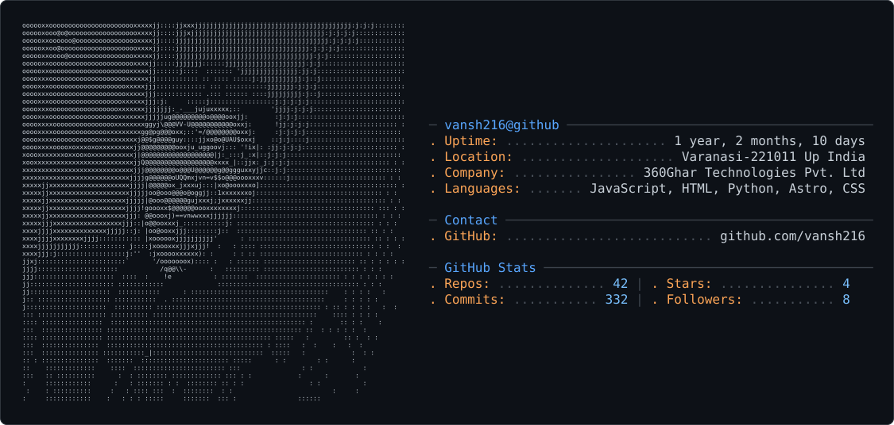

 

<h1 align="center">

 
  
  Hey everyone
  👋
  I 
  am 
  Vansh
</h1>

###

<h3 align="center">Full Stack Developer</h3>

###
<picture>
  <source media="(prefers-color-scheme: dark)" srcset="dark_mode.svg" />
  <source media="(prefers-color-scheme: light)" srcset="light_mode.svg" />
  
</picture>

  <a>
  
  
  
  

###

  

###

  

###

  

###

  
  
  
  
  
  
  
  
  
  
  
  
  
  
  
  
  
  
  
  
  
  
  
  
  
  
  
  
  
  
  
  
  

###

  

###

<picture>
  <source media="(prefers-color-scheme: dark)" srcset="https://raw.githubusercontent.com/vansh216/vansh216/output/pacman-contribution-graph-dark.svg">
  <source media="(prefers-color-scheme: light)" srcset="https://raw.githubusercontent.com/vansh216/vansh216/output/pacman-contribution-graph.svg">
  
</picture>

###
